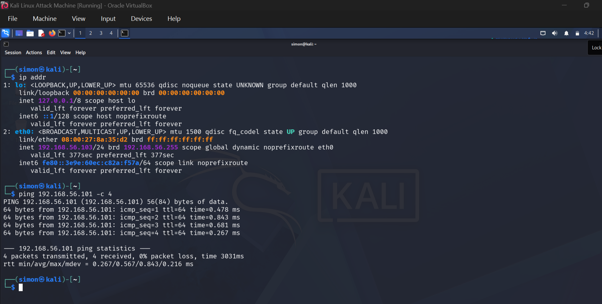
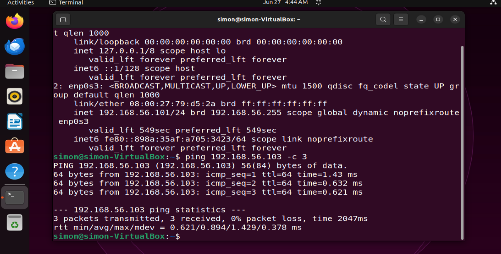

# Cybersecurity Project #1: Home Lab Setup

## Objective
Build an isolated, safe environment for security testing, detection, and system hardening without risk to production networks.

This lab is the foundation for my 100-Day Metasploit + Blue Team Lab Challenge.

##  Lab Architecture & Tools
| Component | Version | Purpose |
| --- | --- | --- |
| **Hypervisor** | VirtualBox 7.x | Host multiple isolated VMs |
| **Attacker VM** | Kali Linux 2024.x | Offensive tools: Metasploit, Nmap |
| **Target VM** | Ubuntu Desktop 22.04 LTS | Blue Team: FIM, logging, hardening |
| **Target VM** | Windows 10/11 Evaluation | Active Directory, Sysmon, Event Logs |
| **Network** | Host-Only Network | Isolated, no internet exposure |

##  Step-by-Step Setup

### 1. Install VirtualBox
1. Download and install `VirtualBox`.
2. Enable Virtualization in BIOS/UEFI: `Intel VT-x / AMD-V`.

### 2. Create Kali Linux VM [Attacker]
**Specs:** `RAM: 4GB` | `CPUs: 2` | `Storage: 40GB`
1. Create new VM → Type: Linux → Version: Debian 64-bit
2. Attach Kali Linux ISO → Install with default settings.
3. Post-install: `sudo apt update && sudo apt upgrade -y`

### 3. Create Ubuntu Desktop VM [Target]
**Specs:** `RAM: 2GB` | `CPUs: 1` | `Storage: 20GB`
1. Create new VM → Type: Linux → Version: Ubuntu 64-bit
2. Install Ubuntu Desktop. During install, check "Install OpenSSH server" OR run: sudo apt install openssh-server -y

### 4. Configure Host-Only Networking
1. VirtualBox: `File > Tools > Network Manager` → Create `Host-Only Network`.
2. Set both Kali and Ubuntu NICs to `Host-Only Adapter`.
3. Result: VMs can talk to each other, but not the internet.

### 5. Verify Connectivity
From Kali terminal:
ip addr
ping ubuntu-ip Expected: 0% packet loss.6.

Evidence / Proof

### 6. Verify Connectivity
From Ubuntu terminal:
ip addr
ping kali-Ip

Start Experimenting Safely
Lab is now ready for: 
1. Port scanning,
2. Metasploit, FIM with AIDE,
3. Log analysis,
4. Hardening.

Key Skills & Learnings
Virtualization: VM provisioning, resource allocation, snapshots

Networking: Host-Only vs NAT vs Bridged, static IPs

Linux Administration: Ubuntu Server install, SSH, package management Security 

Mindset: Building an isolated range for safe testing

Next Steps

Project #2: AIDE File Integrity Monitoring on Ubuntu Server.
Author: Simon Adeka | Cybersecurity Analyst | Abuja, NG
Part of: 100-Day Metasploit + Blue Team Lab Challenge
